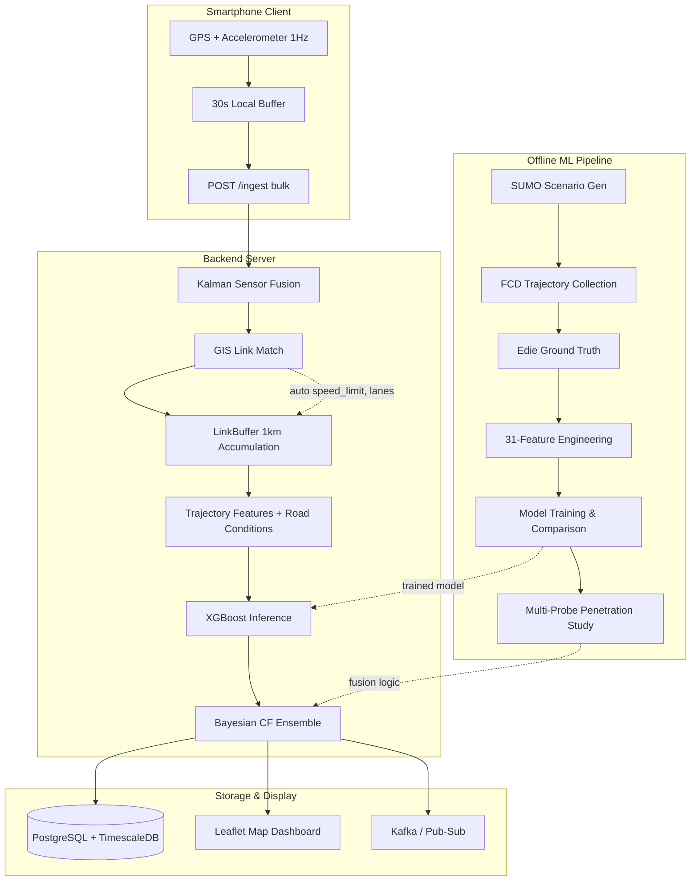
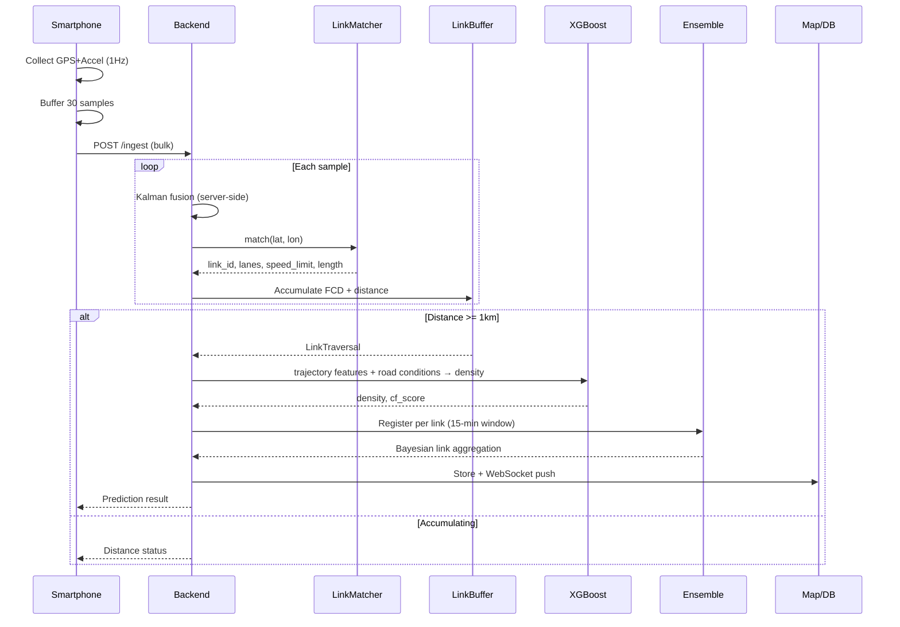
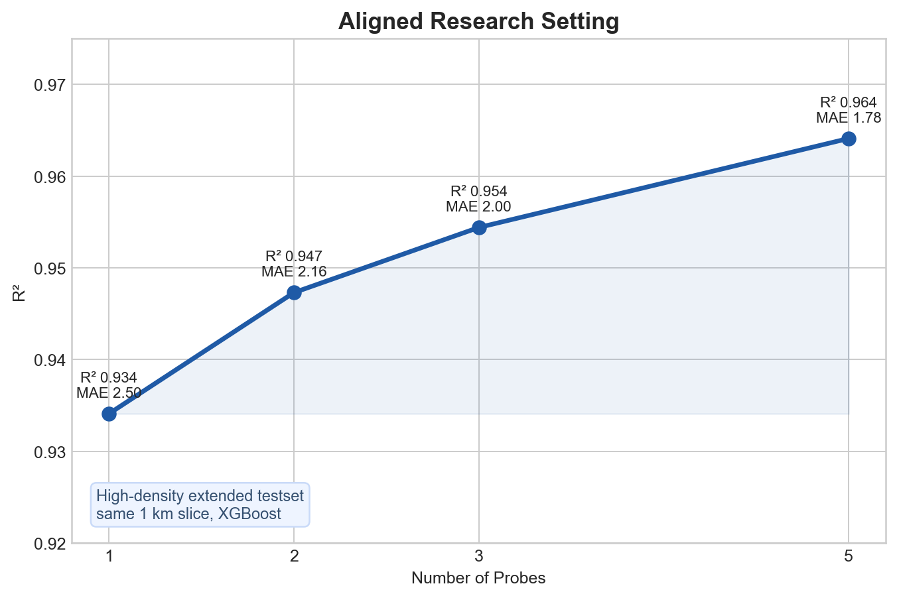
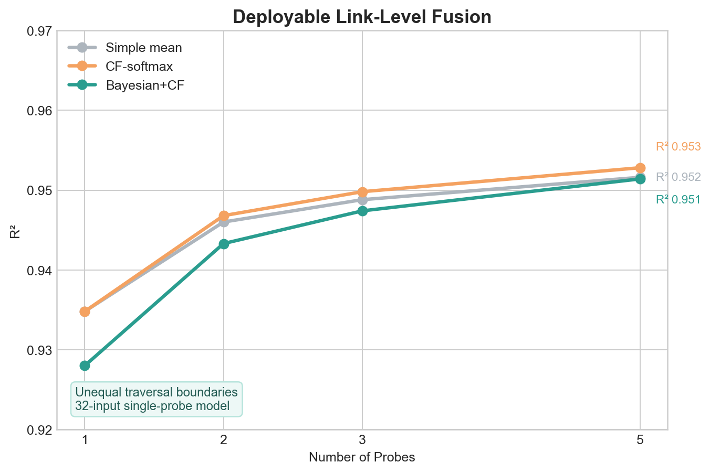
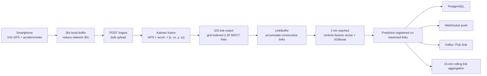
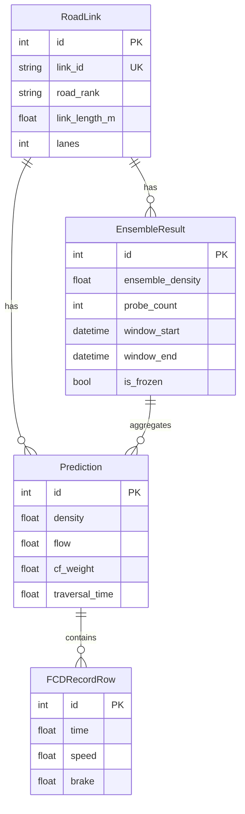

# ProbeDensity — Traffic Density Estimation from Probe Vehicles

Predict how congested a road is using only smartphone sensor data from vehicles driving on it.

ProbeDensity is an end-to-end traffic density estimation system that turns GPS + accelerometer trajectories from probe vehicles into per-link density estimates. The project spans simulation-based data generation, feature engineering, model comparison, real-time serving, and a deployable multi-probe aggregation pipeline for real roads. Its focus is probe-based traffic density estimation under realistic road-network constraints, with the multi-probe method treated as one part of that larger system.

**[Live Demo](https://traffic-estimator-gcbqhrztha-du.a.run.app/)** · **[API Docs](https://traffic-estimator-gcbqhrztha-du.a.run.app/docs)** · **[Map](https://traffic-estimator-gcbqhrztha-du.a.run.app/map)** · **[ML Pipeline](https://traffic-estimator-gcbqhrztha-du.a.run.app/ml-pipeline/)**

<p align="center">
  
</p>

---

## Table of Contents

- [What This Project Does](#what-this-project-does)
- [Problem](#problem)
- [System Architecture](#system-architecture)
- [ML Pipeline Workbench](#ml-pipeline-workbench)
- [ML Approach](#ml-approach)
- [Backend and Data Engineering](#backend-and-data-engineering)
- [Lessons Learned](#lessons-learned)
- [Tech Stack](#tech-stack)
- [Running the Project](#running-the-project)
- [Project Structure](#project-structure)

---

## What This Project Does

1. **Generates labeled traffic data** — 49K SUMO scenarios → 209K probe samples of 6-channel trajectories (VX, VY, AX, AY, speed, brake), including bottleneck scenarios for wider congestion coverage.
2. **Designs 31 handcrafted trajectory features** from car-following theory — speed statistics, acceleration patterns, braking behavior, lateral dynamics, time-series properties; the deployed single-probe runtime model then adds `num_lanes` and `speed_limit`, giving **31 + 2 = 33 inputs**
3. **Trains and compares 6 model families** — XGBoost, LightGBM, LSTM, CNN-1D, GPR, FD baselines under the same pipeline; the aligned single-probe baseline reaches **MAE 2.50 veh/km/lane, MAPE 39.7%** (R² 0.934)
4. **Studies multi-probe aggregation in two settings** — aligned 1 km probe slices for the research case, and overlap-aware link-level fusion for the deployment case; the aligned 5-probe result reaches **MAE 1.78, MAPE 24.6%** (R² 0.964)
5. **Builds a link-level fusion system for deployment** — when probes do not share the same traversal boundaries, the system predicts per probe first and then aggregates unequal traversals at the road-link level with Bayesian car-following fusion; the current deployable 5-probe result is **MAE 2.18, MAPE 37.2%** (R² 0.951)
6. **Wraps the offline workflow in a dashboard** — scenario generation, feature toggles, model selection, run history, scatter plots, and feature-importance inspection in one GUI
7. **Serves link-level predictions** — FastAPI, GIS link matching (2.2K Seoul arterial links), rolling Bayesian link aggregation, PostgreSQL, Kafka/Pub-Sub, Leaflet map

Solo end-to-end project: simulation → ML → backend → deployment.

## Problem

Traffic density — vehicles per kilometer — is the fundamental measure of road congestion. But measuring it traditionally requires **loop detectors, cameras, or radar** embedded in the road, which are expensive and cover only major corridors.

Probe vehicles (taxis, ride-hails, smartphones) are everywhere, but a single probe only observes its own trajectory. The core challenge: **can you estimate how many vehicles surround a probe, using only its speed, acceleration, and braking patterns?**

The single-probe baseline reaches **MAE 2.50 veh/km/lane, MAPE 39.7%** (R² 0.934) across a density range up to ~67 veh/km/lane. The project studies two multi-probe regimes on top: an **aligned research setting** where 5 probes share the same 1 km slice, and a **deployed road-network setting** where probes traverse overlapping but mismatched 1 km cuts.

---

## System Architecture



### Real-Time Inference Sequence



### Key Design Decisions

**Link-based inference over 1 km accumulation**: The system accumulates FCD as the probe traverses consecutive road links and triggers prediction at **1km+ distance**. In deployment, different probes rarely cut that 1 km window at the same place, so the key engineering step is the **link-level fusion layer** that aggregates density through the road links those unequal traversals overlap.

**Thin client, centralized processing (with tradeoffs)**: The phone buffers about 30s of raw GPS+accelerometer data and uploads it in bulk, while the server handles Kalman fusion, GIS matching, feature extraction, inference, and ensemble logic. This centralizes map logic and model updates in one place, with the tradeoff of higher dependence on backend availability and network delivery.

**Two-stage multi-probe design**: The research version studies aligned multi-probe aggregation when several probes observe the same 1 km slice. The deployed version predicts density for each traversal first and then aggregates those unequal traversals at the road-link level inside a rolling window.

---

## ML Pipeline Workbench

The offline workflow is organized around an ML pipeline dashboard so experiment work stays manageable from one place: generate scenarios, resume from saved assets, adjust scenario distributions, choose feature sets, pick model families, and inspect evaluation output after training.

The GUI matters because this project has many interacting choices that are painful to juggle by hand. A run may change scenario counts, probes per scenario, FD residual settings, handcrafted feature groups, window features, and training models all at once. The dashboard turns those into a reproducible workbench with one consistent experiment surface.

It also acts as an analysis surface after training:

- **From Scratch / Resume / Scenario Config** tabs cover new runs, partial reruns, and distribution-level scenario control.
- **Feature selection controls** let experiments include or exclude the 31 handcrafted features and window features without changing code.
- **Model selection** supports direct comparison across XGBoost, LightGBM, CNN-1D, LSTM, and window models.
- **Run history and inline results** keep completed runs explorable inside the UI.
- **Evaluation views** show per-model metrics, actual-vs-predicted scatter plots, and feature-importance charts so failure modes are easier to inspect.

<p align="center">
  
  
</p>

On the hosted server the dashboard is intentionally view-only, but locally it is the main interface for running and analyzing the ML pipeline.

---

## ML Approach

### Feature Engineering

The project defines 31 handcrafted trajectory features from car-following theory and traffic flow dynamics, registered via `@register_feature` decorator and selected through YAML config. The deployed single-probe runtime model then adds `num_lanes` and `speed_limit`, giving **31 + 2 = 33 total inputs**.

| Category | Features | Rationale |
|----------|----------|-----------|
| Speed statistics | mean, std, cv, iqr, min, max, median, p10, p90 | FD relationship proxy |
| Acceleration | ax_mean, ax_std, ay_mean, ay_std, jerk_mean, jerk_std | Car-following interaction intensity |
| Braking | brake_count, brake_time_ratio, mean_brake_duration | Congestion indicator |
| Stops | stop_count, stop_time_ratio, mean_stop_duration, slow_duration_ratio | Queue detection |
| Lateral | vy_mean, vy_std, vy_min, vy_max, vy_variance, vy_energy | Lane-change proxy |
| Time-series | speed_autocorr_lag1, speed_fft_dominant_freq, sample_entropy | Flow regime classification |

### Multi-Probe Aggregation

#### 1. Aligned research setting

In the research setting, multiple probes are aligned to the **same 1 km slice** before aggregation. Each handcrafted feature is aggregated across the selected probes as a mean and a standard deviation, and a tabular XGBoost is trained on that aggregated vector. The aligned 5-probe result reaches **MAE 1.78 veh/km/lane, MAPE 24.6% (R² 0.964)**.

```math
\bar{f}_k = \frac{1}{N}\sum_{i=1}^{N} f_{k,i}, \qquad
s_k = \sqrt{\frac{1}{N}\sum_{i=1}^{N}(f_{k,i}-\bar{f}_k)^2}
```

```math
\hat{k}_{\text{aligned}} = g_{\theta}\left(\bar{f}_1, s_1, \ldots, \bar{f}_K, s_K, \text{road conditions}\right)
```

#### 2. Deployable road-network setting

On real road links, probes traverse overlapping but different 1 km boundaries, so the deployed system changes the order:

```math
\hat{k}_t = f_{\theta}(x_t)
```

```math
\sigma_{\mathrm{obs},t} = \sigma_{\mathrm{base}} \exp(-\lambda \,\mathrm{cf}_t)
```

```math
\hat{k}_{\mathrm{link}} =
\frac{
\mu_{\mathrm{prior}}/\sigma_{\mathrm{prior}}^2 +
\sum_{t \in T(\mathrm{link})}\hat{k}_t/\sigma_{\mathrm{obs},t}^2
}{
1/\sigma_{\mathrm{prior}}^2 +
\sum_{t \in T(\mathrm{link})}1/\sigma_{\mathrm{obs},t}^2
}
```

First predict density for each traversal, then aggregate only the traversals whose windows overlap the same road link. The deployment version therefore uses **post-hoc Bayesian fusion with car-following-informed observation noise** at the link level.

### Results

**Aligned research setting** (1 km, tabular XGBoost with aggregated handcrafted probe features):

| N (probes) | MAE (veh/km/lane) | MAPE | R² |
|------------|------------------|------|-----|
| 1 | 2.50 | 39.7% | 0.934 |
| 2 | 2.16 | 32.5% | 0.947 |
| 3 | 2.00 | 28.7% | 0.954 |
| 5 | **1.78** | **24.6%** | **0.964** |

MAE=1.78 means **about 2 vehicles per km per lane** error across a density range up to ~67 veh/km/lane. This table is the aligned research setting: probes are assumed to describe the same observation slice, and the model uses aggregated handcrafted probe features with road conditions.

<p align="center">
  
</p>

**Deployable road-network setting** (unequal traversal boundaries, 33-input single-probe model, MAE in veh/km/lane with R² in parentheses):

| Method | N=1 | N=2 | N=3 | N=5 |
|--------|-----|-----|-----|-----|
| Simple mean | 2.46 (0.935) | 2.30 (0.946) | 2.23 (0.949) | 2.18 (0.952) |
| CF-softmax | 2.46 (0.935) | 2.28 (0.947) | 2.21 (0.950) | 2.15 (0.953) |
| **Bayesian+CF** | **2.59 (0.928)** | **2.36 (0.943)** | **2.27 (0.947)** | **2.18 (0.951)** |

The deployable release path improves as more unequal traversals are available; CF-softmax and Bayesian+CF land within ~0.03 MAE of each other at N=5, and **Bayesian+CF is the deployed rule** because it exposes the per-link posterior uncertainty the map display and downstream aggregation need.

<p align="center">
  
</p>

The gap between the aligned **MAE 1.78** and the deployable **MAE 2.18** is the gap between two different problems:

- **Aligned (MAE 1.78, R² 0.964)**: ideal same-slice fusion, where probes can be aligned to the same 1 km segment
- **Deployable (MAE 2.18, R² 0.951)**: link-level fusion, where probes arrive on different link chains and must be combined after per-probe prediction

**Notes on what these numbers mean:**

- Here, **1 km** means the accumulated traversal length across chained road links in the link buffer. It is **not** a fixed SUMO link length.
- Both aligned and deployable metrics are pulled from `results/multi_probe/high_density_full_eval_v2.json`.

**Reproduce the aligned and deployable numbers:**

```bash
python scripts/generate_scenarios.py --bottleneck  # generates 1-lane high-density 5K
python scripts/eval_high_density.py
```

**Runtime model**: XGBoost on the 33-input vector (31 handcrafted trajectory features + `num_lanes` + `speed_limit`).

---

## Backend and Data Engineering

### Ingestion Pipeline



### Optimization Decisions

| Optimization | What it does | Impact |
|-------------|-------------|--------|
| Grid spatial index | 0.001° cells, search 3×3 neighborhood only | O(2.2K) → O(9 cells), <1ms |
| Re-match skip | Don't re-query GIS until probe moves >30m | ~90% fewer GIS calls |
| 30s bulk ingest | Client buffers locally, sends batch | 30× fewer HTTP requests |
| Sticky link | Require confirmed link change before switching | Prevents GPS jitter traversals |
| Graceful degradation | DB/Kafka/GIS each optional | Prediction always available |

### Database Schema



**Aggregation lifecycle**: new probe → find/create active link window → Bayesian update → extend window. No new probe within 15 min → freeze. Garbage-collected after 1 hour.

### Sensor Fusion

2D Kalman filter per session: state `[x, vx, y, vy]` in equirectangular frame. GPS measurement update (σ=5m) + accelerometer control input (heading-rotated). Sessions garbage-collected after 10 min inactivity.

---

## Lessons Learned

- **The main contribution is two-stage because the research setting and the deployment setting are different.** The project first studies aligned multi-probe aggregation in the 5-probe, 1 km setting, then builds a link-level fusion system that preserves most of that gain under real traversal-boundary mismatch.
- **Single-probe baseline: MAE 2.50, MAPE 39.7% (R² 0.934)** on 49K scenarios spanning density 0–67 veh/km/lane. XGBoost on 33 inputs (31 handcrafted + 2 road conditions) is the runtime model.
- **The current web demo leaves a lot of device-side compute unused.** In the browser-first version, the phone is mostly a thin client. If this moves into an installed app or an in-vehicle system, more of the buffering, sensor fusion, feature preparation, and filtering can run locally before upload, reducing server load and latency.
- **The deployed contribution is overlap-aware Bayesian link fusion built on top of the 1 km traversal unit.** Real vehicles observe different cut points across the same road timeline, so the system first predicts each traversal and then fuses density on the links those windows overlap.
- **The implementation problem was fusion of unequal traversal windows.** Real probes begin and end their useful 1 km observation at different places, so the deployable algorithm predicts first and fuses second at the link level.
- **Direct spacing from ADAS or connected vehicles is the most promising next sensor upgrade.** The current phone-only system infers inter-vehicle gap indirectly from trajectory shape; direct headway or forward-gap sensing would make that signal observable instead of latent.
- **Simulation fidelity is the main experimental constraint.** Single straight-link SUMO scenarios rarely produce realistic stop-and-go waves, so future work should use richer multi-link networks with lane drops, signals, and merge sections.

---

## Tech Stack

| Layer | Technologies |
|-------|-------------|
| **ML** | XGBoost, LightGBM, PyTorch (CNN-1D, LSTM, DeepSets), GPyTorch, scikit-learn, SHAP |
| **Backend** | FastAPI, uvicorn, WebSocket, Pydantic, SQLAlchemy async |
| **Database** | PostgreSQL + TimescaleDB, asyncpg |
| **Streaming** | Apache Kafka, Google Cloud Pub/Sub |
| **Spatial** | MOCT standard links, grid-indexed matcher, GeoJSON, Leaflet.js |
| **Infra** | Docker, Cloud Run, Artifact Registry, Secret Manager, GitHub Actions |
| **Data** | Apache Parquet, NumPy NPZ, SUMO (TraCI), Edie's definitions |

> **Note:** The [live demo](https://traffic-estimator-gcbqhrztha-du.a.run.app/) runs in read-only mode — ML Pipeline execution is disabled on the hosted server. Clone and run locally to train models.

## Running the Project

### Local (recommended for development)

```bash
python -m venv .venv
source .venv/bin/activate
pip install -e ".[dev]"
python scripts/run_console.py
```

Then open:
- `http://localhost:8000/` — project overview
- `http://localhost:8000/map` — link density map
- `http://localhost:8000/mobile` — mobile probe collection
- `http://localhost:8000/ml-pipeline/` — ML training dashboard
- `http://localhost:8000/docs` — API schema

### Docker

```bash
docker-compose up -d
curl localhost:8000/health
```

### ML Pipeline (simulation → training → evaluation)

```bash
# Full pipeline
python scripts/run_all.py --config configs/default.yaml

# Or step by step
python scripts/generate_scenarios.py --config configs/simulation/scenarios.yaml
python scripts/run_simulation.py --config configs/simulation/scenarios.yaml  # requires SUMO
python scripts/extract_features.py --config configs/default.yaml
python scripts/train.py --config configs/default.yaml
python scripts/evaluate.py --config configs/default.yaml
```

The ML Pipeline dashboard (`/ml-pipeline/`) provides a web UI for these steps with run versioning and resume support. On the hosted server, pipeline execution is disabled — clone and run locally.

### Environment Variables

| Variable | Required | Description |
|----------|----------|-------------|
| `DATABASE_URL` | No | PostgreSQL async URL. Server runs without DB if unset |
| `CONFIG_PATH` | No | Model and GIS config path (default: `configs/default.yaml`) |
| `MIN_TRAVERSAL_DISTANCE_M` | No | Min link accumulation before prediction (default: 1000) |
| `KAFKA_BOOTSTRAP_SERVERS` | No | Kafka broker. Falls back to Pub/Sub or skips |

### CI/CD and Deployment

Pushes to `main` trigger CI:
1. **Lint** — `ruff check + format`
2. **Type check** — `mypy src/api/`
3. **Test** — `pytest` (145 tests × Python 3.11–3.13)

GitHub Release triggers CD:
1. **Build** — Docker image → GCP Artifact Registry
2. **Deploy** — Cloud Run (0–2 auto-scaling, 2 GiB memory)
3. **Verify** — health check on deployed URL

## Project Structure

```
src/
├── api/            FastAPI app, link-based ingest, ensemble, async DB
├── data/           Dataset loading, Parquet I/O, preprocessing
├── evaluation/     Metrics, SHAP, traffic state classification
├── features/       @register_feature registry, 7 feature modules
├── gis/            Grid-indexed MOCT link matcher (road hierarchy)
├── models/         XGBoost, LightGBM, CNN1D, LSTM, FD, multi-probe DeepSets
├── simulation/     SUMO network gen, FCD collection, Edie ground truth
├── streaming/      Kafka/Pub-Sub abstraction, Kalman sensor fusion
├── training/       TabularTrainer (GroupKFold), DLTrainer (PyTorch)
├── utils/          Config, logging, seed, checkpoints
└── visualization/  Plots, SHAP, model comparison

scripts/            Pipeline entry points (train, evaluate, extract, dashboard)
static/             Web pages (console, mobile, map, pipeline manager)
configs/            Hierarchical YAML (inheritable via _base_)
data/gis/           MOCT standard link GeoJSON (2.2K Seoul arterial links)
.github/workflows/  CI (lint+test+build) + CD (Cloud Run deploy)
```

## License

All rights reserved. This repository is shared for portfolio and evaluation purposes only. Not licensed for redistribution or reuse.
