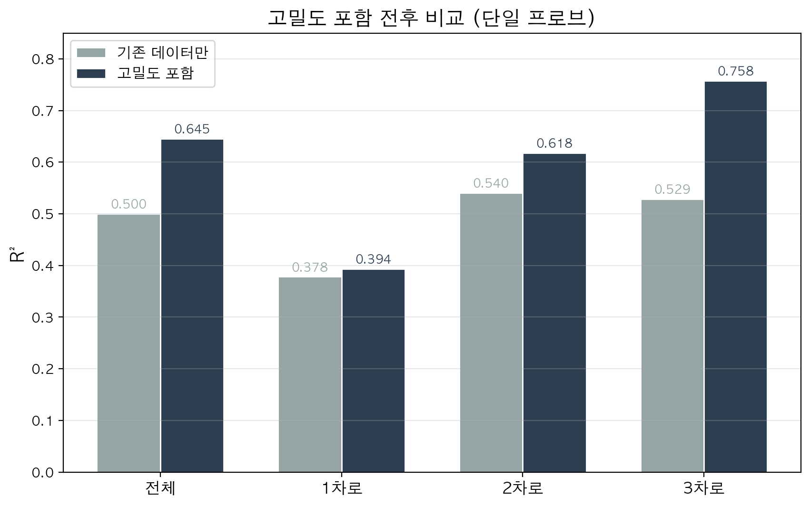
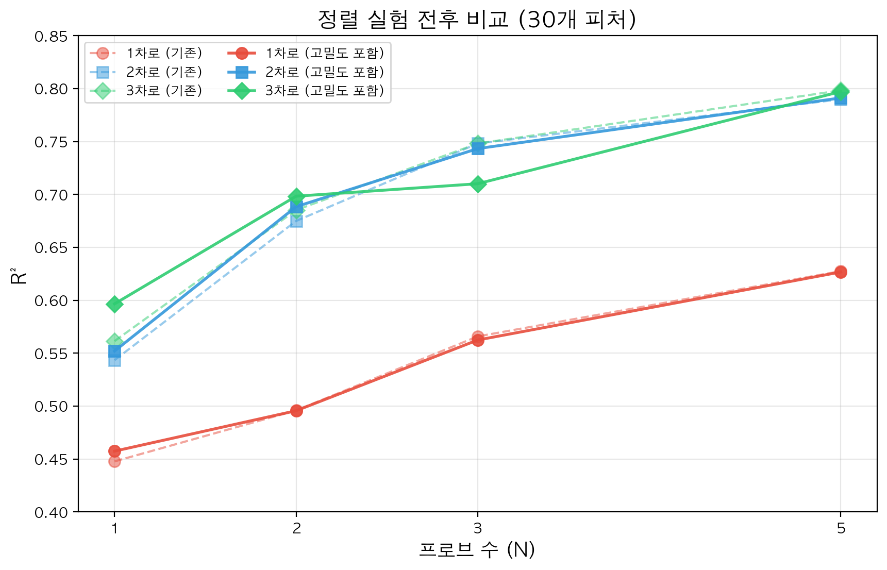
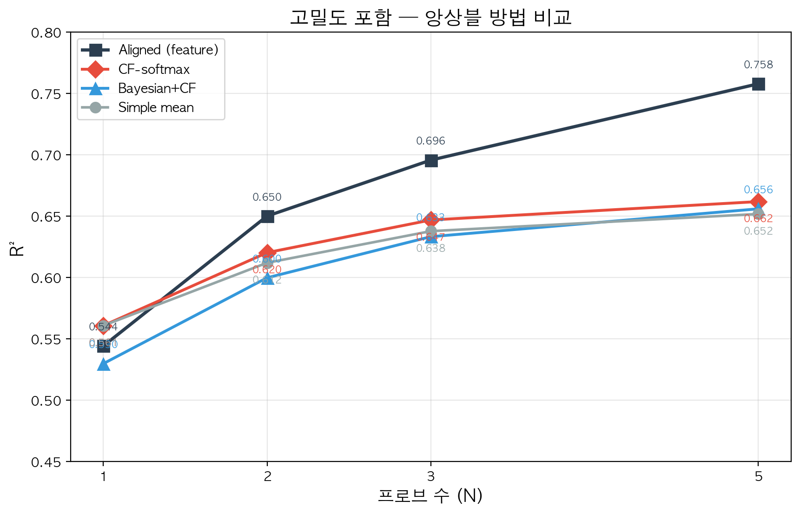
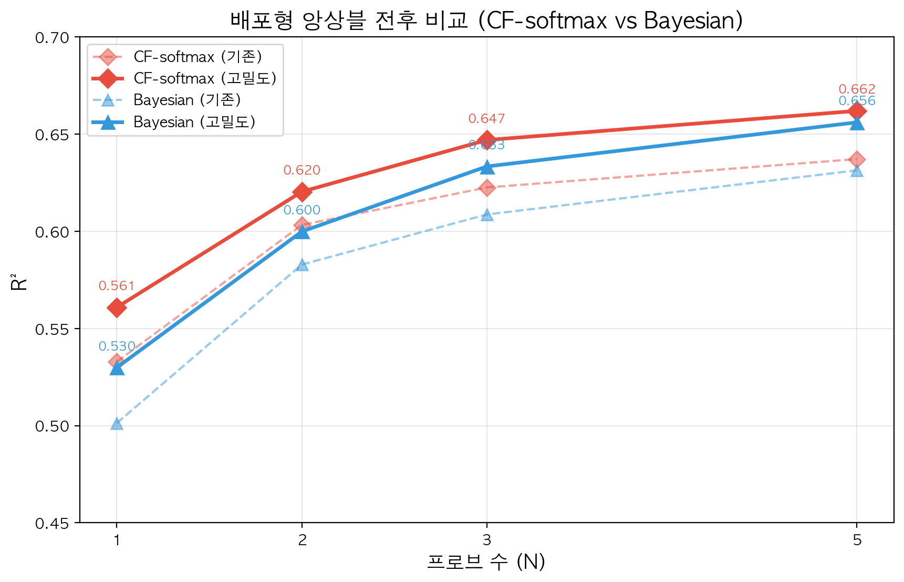
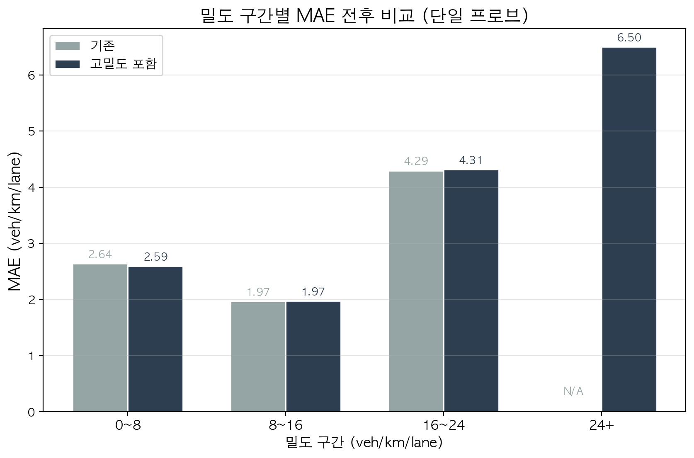

# 6주차 정리

## 1. 이번 주 작업 목적

이번 주의 핵심은 기존 통합 결과를 다시 해석하는 것이었다. 교수님 피드백의 요지는 다음과 같았다.

1. 차로 수가 섞인 결과만 제시하면 해석이 어렵다.
2. 밀도의 정의를 더 명확히 설명해야 한다.
3. 실제 데이터 검증 가능성을 점검해야 한다.
4. 현재 밀도 범위가 충분히 넓은가?

이번 주에는 이 중에서 먼저 **차로 수별 결과 분리**와 **DTG 샘플 검토**를 진행하였다.

### 1.1 R²의 정의와 해석

본 문서에서 사용하는 `R²`는 결정계수(coefficient of determination)이며, 예측값이 실제값의 변동을 얼마나 잘 설명하는지를 나타내는 지표이다. 본 연구에서는 아래 식으로 계산하였다.

$$
R^2 = 1 - \frac{\sum_{i=1}^{n}(y_i-\hat{y}_i)^2}{\sum_{i=1}^{n}(y_i-\bar{y})^2}
$$

여기서 $y_i$는 실제 밀도, $\hat{y}_i$는 예측 밀도, $\bar{y}$는 실제 밀도의 평균이다. 따라서 $R^2=1$이면 예측과 실제가 완전히 일치하고, $R^2=0$이면 입력 정보를 사용하지 않고 평균 밀도만 예측한 기준모형과 동일하며, $R^2<0$이면 그 기준모형보다도 나쁜 예측이라는 뜻이다.

이 해석은 Penn State 통계 강의의 coefficient of determination 설명과, scikit-learn의 `r2_score` 공식 문서를 기준으로 정리하였다. Penn State는 `R²`를 반응변수 변동 중 회귀모형이 설명하는 비율로 설명하고, scikit-learn 공식 문서는 `R²`의 최적값이 1.0이며 평균만 예측하는 상수모형은 0.0, 그보다 더 나쁘면 음수가 될 수 있다고 명시한다.

교수님께 제시할 수 있는 참고 출처:
- [Penn State STAT 500, 9.3 Coefficient of Determination](https://online.stat.psu.edu/stat500/book/export/html/597)
- [scikit-learn `r2_score` documentation](https://scikit-learn.org/stable/modules/generated/sklearn.metrics.r2_score.html)

---

## 2. 차로 수별 정렬된 1 km 다중 프로브 결과

기존 아카이브 데이터셋을 차로 수별로 다시 나누어 평가하였다. 이 실험은 같은 1 km 관측 목표를 공유하는 프로브들을 묶어 하나의 집계형 입력 벡터를 만들고, 이를 XGBoost로 학습하는 정렬된 다중 프로브 설정이다.

전체 test split은 `5306`개 시나리오였고, 차로 수별 test 시나리오 수는 다음과 같다.

| 차로 수 | 테스트 시나리오 수 (= 평가 샘플 수) |
|---|---:|
| 1차로 | 1,352 |
| 2차로 | 2,633 |
| 3차로 | 1,321 |

### 2.1 R² 결과

| 차로 수 | N=1 | N=2 | N=3 | N=5 |
|---|---:|---:|---:|---:|
| 1차로 | 0.430 | 0.484 | 0.520 | 0.597 |
| 2차로 | 0.525 | 0.672 | 0.727 | 0.779 |
| 3차로 | 0.490 | 0.664 | 0.729 | 0.800 |

### 2.2 MAE 결과

| 차로 수 | N=1 | N=2 | N=3 | N=5 |
|---|---:|---:|---:|---:|
| 1차로 | 2.471 | 2.364 | 2.249 | 2.039 |
| 2차로 | 2.373 | 1.956 | 1.777 | 1.590 |
| 3차로 | 2.360 | 1.889 | 1.717 | 1.493 |

### 2.3 왜 1차로가 더 어려운가

직관적으로는 차로 수가 적을수록 구조가 단순해서 더 쉽게 보일 수 있다. 그러나 이 문제는 도로 구조를 분류하는 것이 아니라, **프로브 궤적으로 링크 평균 밀도를 역추정하는 문제**이다.

N=5 조건에서 테스트 시나리오별로 5대 프로브를 뽑아 단일 프로브 예측값의 표준편차를 다시 계산하면 다음과 같다.

| 차로 수 | N=5 프로브 예측 std |
|---|---:|
| 1차로 | 1.02 |
| 2차로 | 1.34 |
| 3차로 | 1.37 |

1차로에서는 추월이 불가능하므로 대부분의 차량이 거의 같은 선행차 조건과 비슷한 속도 패턴을 경험한다. 따라서 5대 프로브를 뽑아도 서로 다른 정보를 관측한다기보다, 비슷한 피처와 비슷한 예측을 반복해서 얻게 된다. 앙상블은 서로 다른 예측을 결합할 때 효과가 커지는데, 1차로에서는 그 다양성이 작기 때문에 프로브 수를 늘려도 정보 이득이 제한적이다.

반면 2차로와 3차로에서는 프로브마다 서로 다른 차로와 다른 차량추종 상태를 경험한다. 그래서 같은 시나리오 안에서도 더 다양한 피처와 예측이 나타나고, 이 다양성이 다중 프로브 결합의 정보 이득을 만든다.

피처-밀도 상관도 같은 방향을 보였다.

| 차로 수 | \|corr(speed_min, density_per_lane)\| | corr(speed_cv, density_per_lane) |
|---|---:|---:|
| 1차로 | 0.584 | 0.210 |
| 2차로 | 0.617 | 0.371 |
| 3차로 | 0.607 | 0.426 |

즉, 1차로가 불리한 이유는 “차량추종이 약해서”라기보다, **모든 프로브가 거의 같은 경험을 하므로 앙상블 이득이 작고, 현재 피처가 밀도와 연결되는 강도도 다차로보다 약하기 때문**이라고 볼 수 있다.
### 2.4 해석

- 모든 차로 수에서 `N`이 증가할수록 성능이 향상되었다.
- 1차로는 `N=5`에서도 `R²=0.597`에 머물러 가장 어려운 조건이었다.
- 2차로와 3차로는 프로브 수 증가 효과가 훨씬 크게 나타났고, 특히 3차로는 `N=5`에서 `R²=0.800`까지 올라갔다.

즉, 기존처럼 차로 수를 한데 섞어 평균 성능만 제시하면 중요한 차이를 놓치게 된다.

---

## 3. 차로 수별 실제 배포형 결과

실제 배포형 실험은 여러 프로브가 동일한 1 km 경계를 공유하지 않는 상황을 가정한다. 따라서 각 주행을 먼저 단일 모델로 예측한 뒤, 겹치는 링크 수준에서 다시 결합한다. 여기서는 simple mean, CF-softmax, Bayesian+CF를 비교하였다.

배포형 차로별 결과도 시나리오 단위로 계산하였고, 아래 숫자는 lane별 평가 샘플 수와 같다.

| 차로 수 | 테스트 시나리오 수 (= 평가 샘플 수) |
|---|---:|
| 1차로 | 1,320 |
| 2차로 | 2,615 |
| 3차로 | 1,371 |

### 3.1 Bayesian+CF의 R² 결과

| 차로 수 | N=1 | N=2 | N=3 | N=5 |
|---|---:|---:|---:|---:|
| 1차로 | 0.471 | 0.501 | 0.529 | 0.547 |
| 2차로 | 0.538 | 0.634 | 0.662 | 0.678 |
| 3차로 | 0.550 | 0.667 | 0.687 | 0.715 |

### 3.2 N=5에서의 후결합 방식 비교

| 차로 수 | Simple mean R² | CF-softmax R² | Bayesian+CF R² |
|---|---:|---:|---:|
| 1차로 | 0.545 | 0.548 | 0.547 |
| 2차로 | 0.659 | 0.669 | 0.678 |
| 3차로 | 0.672 | 0.688 | 0.715 |

| 차로 수 | Simple mean MAE | CF-softmax MAE | Bayesian+CF MAE |
|---|---:|---:|---:|
| 1차로 | 2.266 | 2.253 | 2.226 |
| 2차로 | 2.051 | 2.016 | 1.974 |
| 3차로 | 1.969 | 1.919 | 1.833 |

### 3.3 해석

- 실제 배포형에서도 1차로가 가장 어렵고 3차로가 가장 쉬웠다.
- `N`이 늘어날수록 Bayesian+CF도 안정적으로 성능이 상승하였다.
- `N=5` 기준으로는 2차로와 3차로에서 Bayesian+CF가 가장 좋은 결과를 보였다.
- 1차로에서는 방법 간 차이가 작지만, 2차로와 3차로에서는 후결합 방식의 차이가 더 분명하게 나타났다.

즉, 배포형 실험에서도 차로 수에 따른 차이를 무시하면 중요한 해석을 놓치게 된다. 특히 실제 서비스처럼 여러 주행을 링크 수준에서 다시 결합해야 하는 상황에서는, **차로 수가 많을수록 후결합의 이득이 더 잘 살아난다**는 점을 확인할 수 있었다.

---

## 4. 이번 주 결론

이번 주의 가장 중요한 결론은 두 가지이다.

1. 기존의 통합 성능만으로는 충분하지 않으며, **차로 수별로 결과를 분리해서 제시해야 한다.**
2. 프로브 수 증가 효과는 모든 차로 수에서 유지되지만, **1차로는 구조적으로 더 어려운 문제**이고, 2차로와 3차로에서는 훨씬 더 높은 정확도를 얻을 수 있다.

따라서 이후 발표와 보고서에서는 통합 결과를 메인으로 두기보다, 차로 수별 결과를 먼저 제시하고 마지막에 전체 평균을 보조적으로 제시하는 구성이 더 적절하다.

---

## 5. 고밀도 시나리오 확장 실험

### 5.1 고밀도 시나리오 생성 방법

교수님 피드백에 따라 기존 밀도 범위(0~24 veh/km/lane)를 넘는 고밀도 상황을 만들었다. 방법은 다음과 같다.

1. **레인드랍 병목**: 측정 링크(link0, N차로) 뒤에 N-1차로 병목 링크(link1)를 연결한다. 2차로→1차로, 3차로→2차로.
2. **병목 속도 제한**: link1의 speed_limit을 10~30 km/h로 낮춘다. 이렇게 하면 병목 throughput이 줄어 link0에 대기열이 형성되어 고밀도가 만들어진다.
3. **수요 과포화**: 병목 차로 기준 capacity의 3~5배 수요를 투입한다.

이 설정으로 2,000개 시나리오를 생성하였고(2차로 997개, 3차로 1,003개), density_per_lane은 6.6~67.4 veh/km/lane까지 올라갔다.

| 구간 | 시나리오 수 | 비율 |
|---|---:|---:|
| 0~16 | 276 | 14% |
| 16~24 | 472 | 24% |
| 24~32 | 514 | 26% |
| 32~48 | 607 | 30% |
| 48+ | 131 | 7% |

측정과 라벨(Edie density)은 link0에서만 계산하였고, link1은 병목 역할만 한다.

### 5.2 학습 데이터 구성

기존 35,369 시나리오(176,845행, 0~24 veh/km/lane)에 고밀도 1,760 시나리오(3,643행, 7~67 veh/km/lane)를 합쳐서 새로운 학습 데이터를 구성하였다.

### 5.3 고밀도 포함 전후 비교 (단일 프로브, 32개 피처)

| | 기존만 R² | 기존만 MAE | 기존만 MAPE | 고밀도 포함 R² | 고밀도 포함 MAE | 고밀도 포함 MAPE |
|---|---:|---:|---:|---:|---:|---:|
| **전체** | 0.531 | 2.32 | 38.3% | 0.681* | 2.31 | 37.1% |
| 1차로 | 0.449 | 2.43 | 40.0% | 0.476 | 2.37 | 39.3% |
| 2차로 | 0.559 | 2.30 | 37.8% | 0.646 | 2.29 | 36.6% |
| 3차로 | 0.549 | 2.25 | 37.6% | 0.786 | 2.32 | 36.1% |

\* **주의: 전체 R²=0.681은 밀도 범위 확장 효과를 포함한다.** R²는 전체 분산 대비 설명 비율이므로, 고밀도를 합쳐서 범위가 넓어지면 같은 오차에서도 R²가 올라간다. 공정한 비교를 위해 고밀도 포함 모델을 **기존 test set에만 적용**하면 R²=0.556 (기존 0.531 대비 +0.025), MAE=2.26 (기존 2.32 대비 -0.06)이다. MAE가 내려간 것은 기존 범위에서 실제로 개선된 것이고, After 전체에서 MAE가 비슷해 보이는 것은 고밀도 샘플(MAE=6.50)이 평균을 끌어올리기 때문이다.

### 5.4 정렬 실험 전후 비교 (30개 피처 집계 + num_lanes + speed_limit)

| 차로 | Before N=1 | After N=1 | Before N=5 | After N=5 |
|---|---:|---:|---:|---:|
| 전체 | 0.527 | 0.544 | **0.756** | **0.758** |
| 1차로 | 0.448 | 0.458 | 0.628 | 0.627 |
| 2차로 | 0.544 | 0.552 | 0.790 | 0.791 |
| 3차로 | 0.562 | 0.597 | 0.798 | 0.797 |

정렬 실험에서는 전후 차이가 거의 없다. 고밀도 시나리오가 프로브 5대 조건(>=5 probes)을 만족하는 것이 24/1,760개뿐이라, 정렬 실험의 학습/평가 데이터에 거의 포함되지 않기 때문이다.

### 5.5 배포형 실험 전후 비교 (32개 피처)

**CF-softmax:**

| N | Before R² | After R² | Before MAPE | After MAPE |
|---|---:|---:|---:|---:|
| 1 | 0.572 | 0.589 | — | — |
| 2 | 0.642 | 0.655 | — | — |
| 3 | 0.662 | 0.679 | — | — |
| 5 | **0.680** | **0.695** | 33.4% | 33.5% |

**Bayesian+CF:**

| N | Before R² | After R² | Before MAPE | After MAPE |
|---|---:|---:|---:|---:|
| 1 | 0.539 | 0.558 | — | — |
| 2 | 0.620 | 0.634 | — | — |
| 3 | 0.647 | 0.665 | — | — |
| 5 | **0.674** | **0.688** | 34.8% | 34.9% |

배포형에서는 전후 차이가 약 0.015 정도 나타난다. 배포형은 단일 프로브 모델로 각각 예측한 뒤 합치는 구조이므로, 베이스 모델이 개선되면(0.531→0.556) 그 위에 앙상블이 올라타서 효과가 전파된다. CF-softmax가 Bayesian보다 모든 N에서 일관되게 좋다.

### 5.6 밀도 구간별 성능 비교 (단일 프로브, 32개 피처)

구간별 R²는 구간 내 분산이 작아서 음수가 나온다. 구간별 성능은 **MAE와 MAPE**로 보는 것이 적절하다.

| 구간 | Before MAE | After MAE | Before MAPE | After MAPE |
|---|---:|---:|---:|---:|
| 0~8 | 2.51 | 2.46 | 68.3% | 67.0% |
| 8~16 | 1.93 | 1.93 | 17.0% | 16.9% |
| 16~24 | 4.14 | 4.14 | 23.2% | 23.0% |
| 24+ | (데이터 없음) | 6.18 | — | 17.2% |

기존 범위(0~24)에서는 MAE가 동일하거나 소폭 개선되었다. 24+ 구간은 기존 모델로는 평가 불가능했으나, 고밀도 포함 모델에서는 MAE=6.18으로 추정이 가능해졌다. 다만 24+ 구간의 평가 샘플이 약 300개로 적어 신뢰도가 낮다.

### 5.7 해석

1. **고밀도 시나리오 추가는 기존 범위 성능을 저하시키지 않는다.** 기존 test set 기준 R²=0.531→0.556 (+0.025), MAE=2.32→2.26 (-0.06).
2. **전체 R²=0.681의 상당 부분은 밀도 범위 확장 효과이다.** 공정한 비교에서는 +0.025 향상.
3. **배포형 앙상블에서도 일관된 개선이 나타난다.** CF-softmax N=5에서 0.680→0.695, Bayesian N=5에서 0.674→0.688.
4. **고밀도(24+) 추정이 가능해졌다.** 기존 모델은 이 구간에서 완전 실패(R²=-1.47)했으나, 고밀도 포함 모델은 MAE=6.18으로 작동한다.
5. **고밀도 시나리오의 프로브 수가 부족하다.** 시나리오당 평균 2대뿐이라 정렬 실험(>=5 probes 필요)에 거의 기여하지 못한다. 향후 고밀도 시나리오를 늘리거나 프로브 추출 조건을 완화해야 한다.
6. **R²와 MAE가 반대 방향으로 움직이는 경우가 있다.** 고밀도 데이터를 합치면 전체 R²는 올라가지만 MAE는 비슷하거나 올라간다. 이는 고밀도 샘플의 큰 절대 오차가 평균 MAE를 끌어올리기 때문이다. 공정한 비교에서는 같은 test set에서의 MAE 변화를 봐야 한다.

---

## 6. DTG 샘플 검토

실측 데이터 검증 가능성을 보기 위해 DTG 샘플 1건을 별도로 점검하였다. 먼저 MOCT 표준링크(`MOCT_LINK`)에 매칭한 결과, 총 `1,100개` 포인트가 모두 정상적으로 링크에 매칭되었고, 고유 링크는 `57개`였다. 주요 도로명은 `덕수천2로`, `삼송로`, `세솔로`, `동송로`였다.

그러나 이 샘플은 현재 연구의 대표적 실측 검증 대상으로 사용하기에는 한계가 있다. 매칭된 포인트의 대부분이 `road_rank 107` 로컬도로에 집중되어 있었고, 공개 교통정보로 우선 검토 가능한 링크는 전체 `57개` 중 `7개`, 포인트 기준으로는 약 `6.5%`에 그쳤다. 나머지 약 `93.5%`는 생활권 내부 도로로 분류되어 공개된 속도·교통량 자료만으로 동일 시각의 링크 밀도를 복원하기 어렵다.

즉, 이번 DTG 샘플은 **매칭 가능성 자체는 확인해 준 사례**이지만, 현재 프로젝트의 본 실험처럼 링크 단위 밀도 정답을 안정적으로 구성할 수 있는 자료는 아니다. 따라서 이 샘플은 “실측 연계 가능성 점검용”으로만 해석하고, 본격적인 실측 검증은 주요 간선도로 또는 표준링크 소통정보와 직접 연결되는 경로를 포함한 DTG 샘플로 다시 진행하는 것이 적절하다.

---

## 6. 다음 액션

다음 주에는 아래 순서로 진행하는 것이 적절하다.

1. 차로 수별 결과를 교수 보고서와 발표 자료에 반영한다.
2. 밀도의 정의를 “300–600초 구간의 링크 평균 밀도”로 명확히 다시 쓴다.
3. 실측 검증은 로컬도로 DTG 샘플 대신, 주요 간선도로 또는 표준링크 소통정보와 직접 연결되는 DTG 샘플을 우선 확보한다.

---

## 7. 중간발표 준비 계획

중간발표까지 남은 기간은 약 3주이며, 다음 주부터를 `1주차`로 두고 준비한다.

### 7.1 1주차(다음 주)

- 분석 결과를 교통공학적으로 해석하는 자료를 만든다.
- 시간-공간 평균 밀도의 의미와, 본 연구에서 이 정의를 사용하는 이유를 정리한다.
- 차로 수별 차이, 중간 밀도에서 성능이 높은 이유, 배포형 성능 저하 원인을 교통공학 관점에서 해석한다.
- 실측 검증을 위해 활용 가능한 DTG 데이터를 추가로 확보하거나, 현재 DTG 샘플과 연결 가능한 표준링크 소통정보 자료를 검토한다.
- 동시에 통계적·머신러닝 방법론 설명도 더 명확히 정리한다.
  - 입력 변수
  - 타깃 정의
  - 피처 구성
  - XGBoost와 후결합 방식
  - 평가 지표의 의미

### 7.2 2주차

- 중간발표용 PPT 초안을 만든다.
- 발표 흐름을 문제 정의, 실험 조건, 파이프라인, 핵심 결과, 교통공학적 해석, 한계와 향후 계획 순으로 정리한다.
- 표는 줄이고 그래프와 도식 중심으로 발표 자료를 구성한다.

### 7.3 3주차

- PPT를 보완하고 발표 연습을 진행한다.
- 예상 질문에 대한 답변을 정리한다.
- 슬라이드 문장, 그래프 가독성, 발표 흐름을 최종 점검한다.
